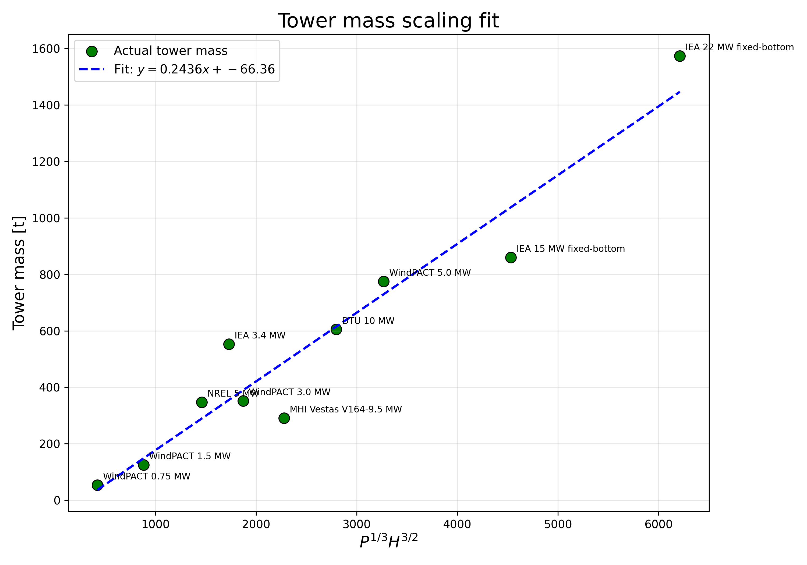
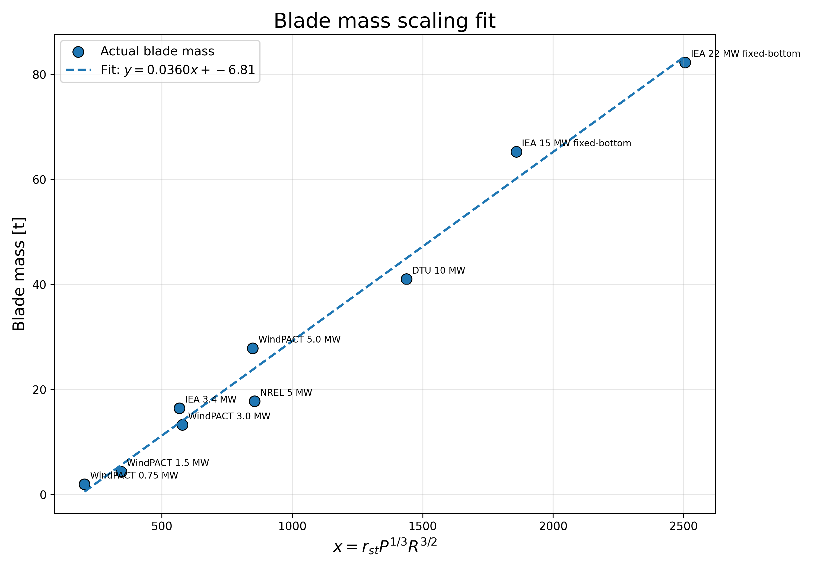

# Wind Turbine Similarity Scaling for OpenFAST Retrofit Studies

This repository contains:
- similarity scaling derivation
- public turbine datasets
- tower and blade mass scaling validation

See derivation here [WTG scaling PDF](Docs/WTG_scaling.docx)

## Tower mass scaling validation

## Blade mass scaling validation

