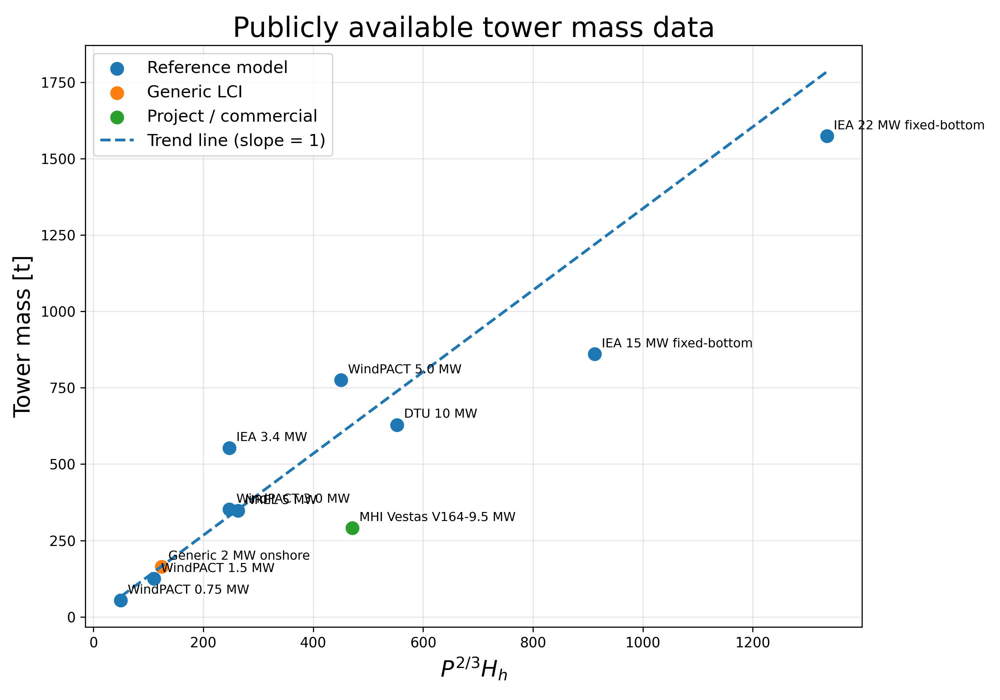

# Wind Turbine Similarity Scaling for OpenFAST Retrofit Studies

This repository contains:
- similarity scaling derivation
- public turbine datasets
- tower mass scaling validation

## Similarity scaling for tower

For geometrically similar tubular towers:

m ~ D^3
I ~ D^4

Using:
σ = M D / (2 I)

Leads to:

M ~ I/D ~ D^3 ~ m

Therefore:

m ~ P^(2/3) H

## Tower mass scaling validation

